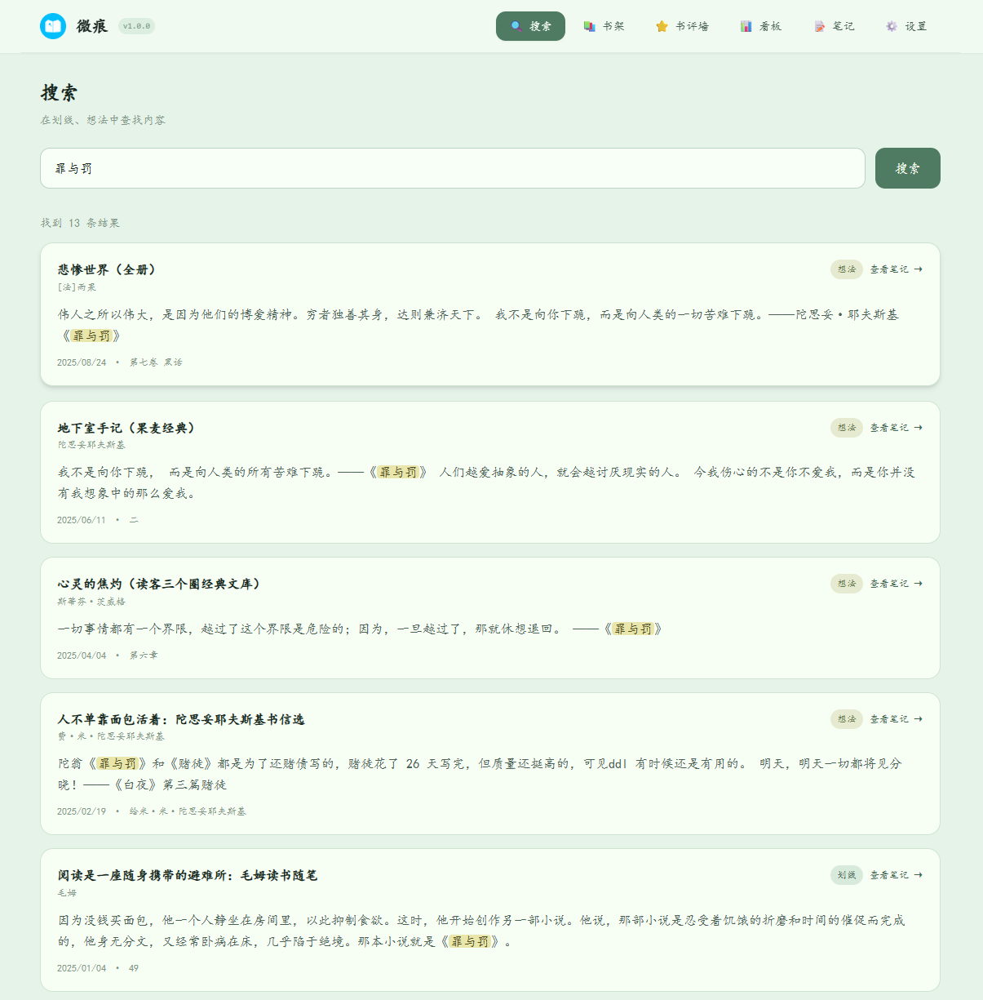
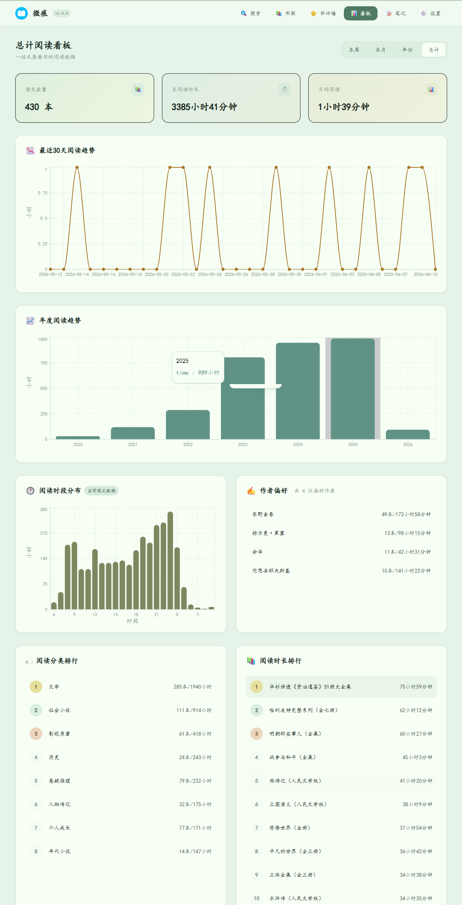
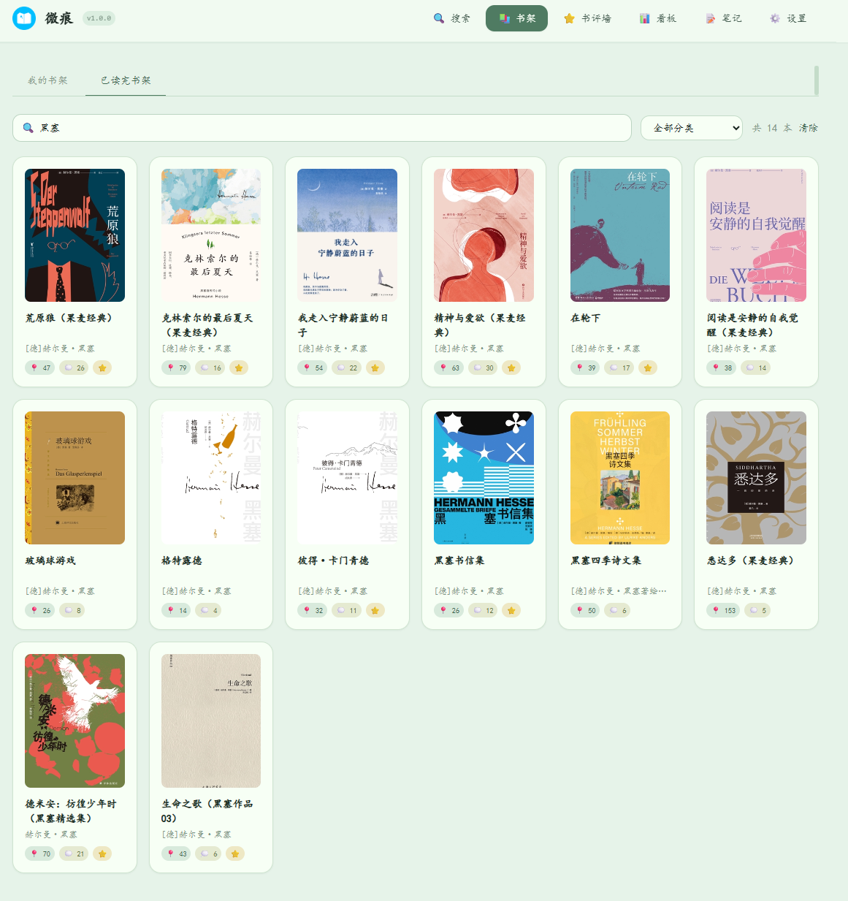
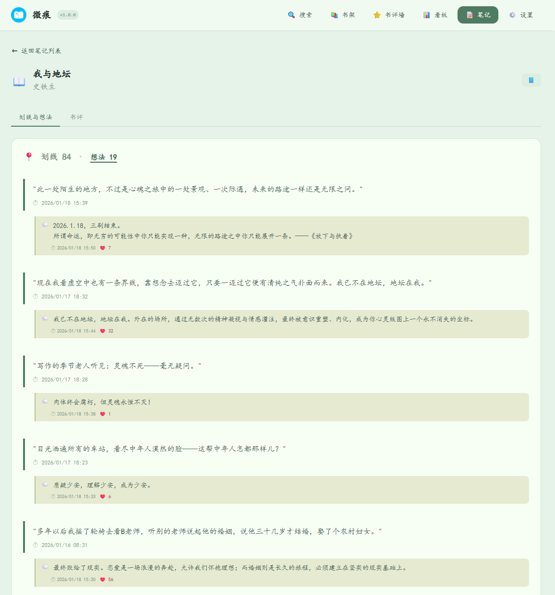
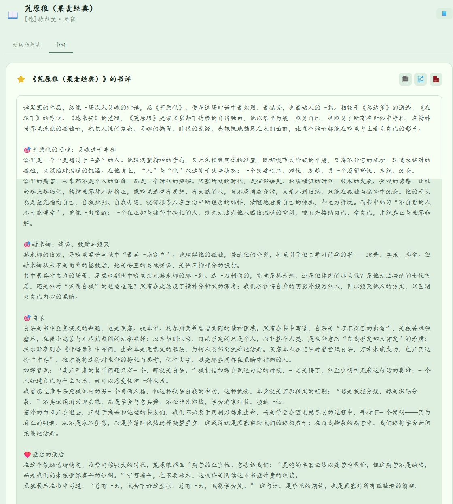
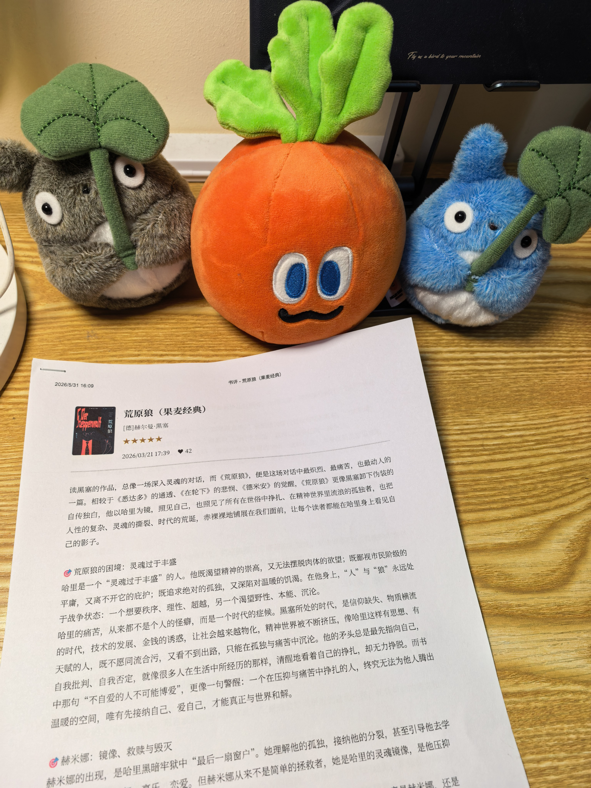
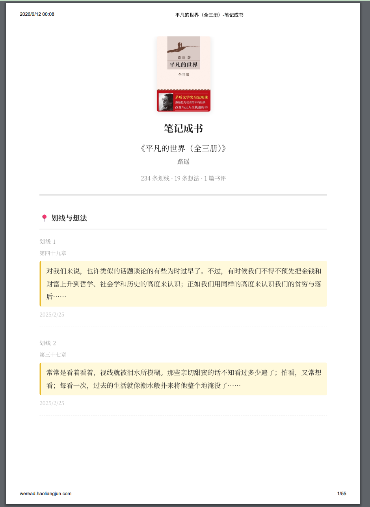
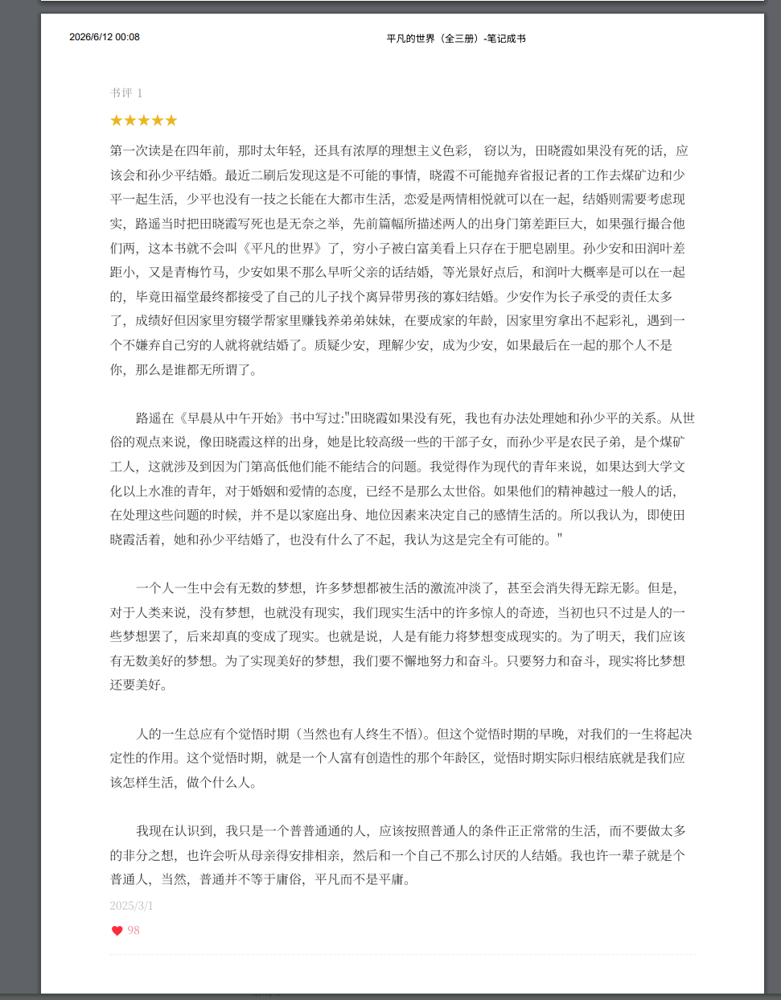
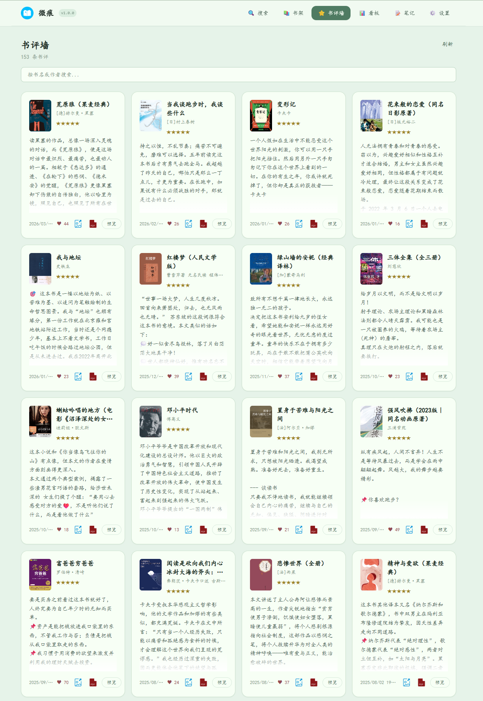
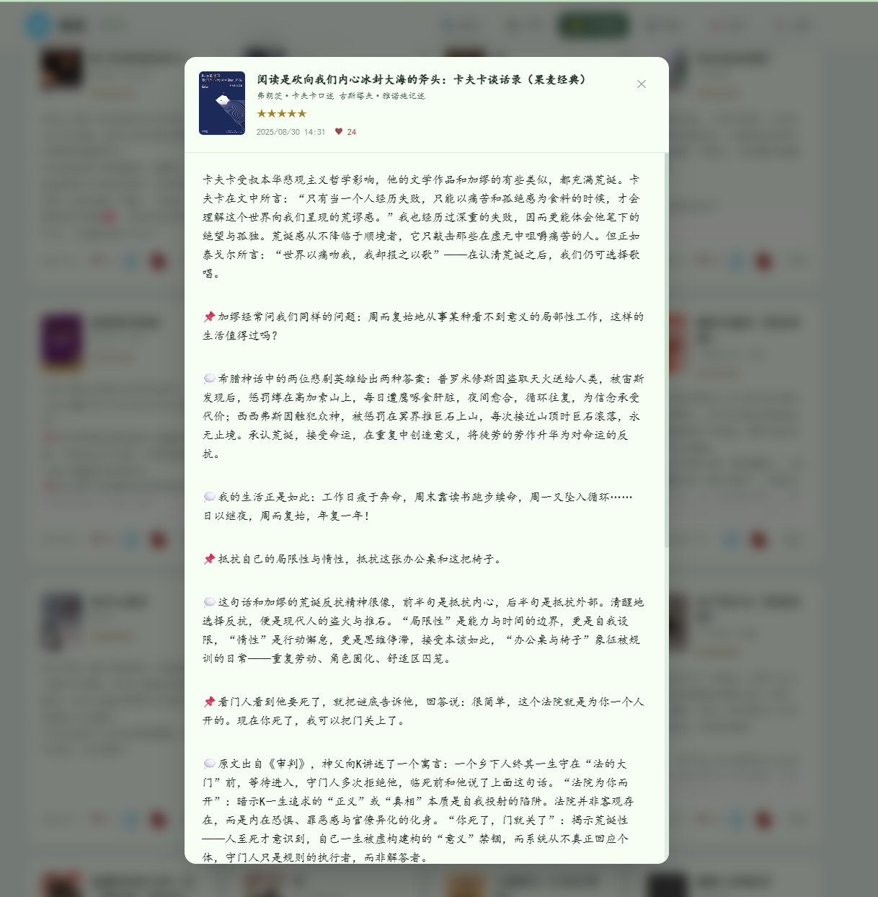

# 微痕 — 功能介绍

[← 返回 README](../README.md)

## 功能特性

### 🔑 API Key 管理

- **页面内配置**：无需 `.env` 文件，直接在设置页输入 Key
- **实时验证**：保存时自动验证 Key 有效性，错误提示带跳转链接
- **本地存储**：Key 仅保存在浏览器 localStorage 中，不会上传服务器
- **保存后自动跳转**：设置完 Key 后自动跳转到看板页面
- **权限控制**：未配置 Key 时自动跳回设置页
- **失效提示**：Key 过期时显示醒目的红色失效提示，引导重新获取
- 
  
### 🔍 搜索

- 在所有书的 **划线、想法** 中按关键词搜索
- 流式渲染搜索结果，实时显示扫描进度
- 可中止搜索，notebooks 列表内存缓存
- 命中结果支持跳转到笔记详情并自动定位高亮

 

### 📊 阅读看板

- **时间模式**：本周 / 本月 / 本年（默认）/ 总计，支持年份选择
- 概览统计：已读完本数、总阅读时长、日均阅读
- 最近 30 天阅读趋势（折线图）
- 选中年份月度趋势、年度趋势
- 阅读时段分布、分类排行、作者偏好、阅读时长排行
- 支持 **导出图片**（PNG）和 **导出 PDF**

### 📚 书架

两个子 tab：**我的书架**、**已读完书架**

- 卡片网格布局，响应式 2~6 列
- 按书名或作者搜索、分类筛选
- 滚动加载，按需扫描书评
- 卡片标签：📍 划线数 / 💭 想法数 / ⭐ 书评，**均可点击直接跳转**到对应笔记详情 Tab
- 无内容的书不可点击，视觉降级提示

### 📝 笔记

笔记列表 + 详情两级页面：

**列表页**：按书名/作者搜索、分类筛选、滚动加载、顶部统计

**详情页**：
- 三个 tab：「划线」「想法」「书评」
- 划线关联想法展示，★ 评分和 ❤️ 点赞数
- 支持 **导出图片** 分享（保留原始换行格式）
- 支持 **导出 PDF**（含书籍封面）
- 来自书架/搜索跳转时，返回按钮动态显示来源（"返回书架列表"/"返回搜索结果"），点击真正返回来源页
- 搜索结果跳转时自动定位并高亮目标

**书评页**

**打印效果**

**笔记成书**

 

### ⭐ 书评墙

- 自动扫描所有书评，流式渲染 + sessionStorage 缓存
- 按书名或作者搜索，滚动加载
- 书评卡片可折叠，点击「预览全文」弹出优化后的全屏阅读弹窗：
  - 主题适配（深色/护眼等模式自动跟随）
  - 更大封面图和字体
  - 入场动画（淡入 + 缩放）
- 支持 **导出图片** 和 **导出 PDF** 分享书评

 

### ⚙️ 设置

个性化配置页面：

**🎨 主题** — 8 种：默认、深色、护眼、浅绿、纸白、冷灰、杏暖、月粉

**🔤 字体** — 8 种可用字体：
- 霞鹜文楷（LXGW WenKai）
- 思源宋体（Noto Serif SC）
- 无衬线（Inter）
- 方正悠宋（FZYouSong）
- 京华老宋体（JingHuaLaoSong）
- 思源黑体（Noto Sans SC，Google Fonts）
- 马山正楷（Ma Shan Zheng，Google Fonts）
- 站酷小薇体（ZCOOL XiaoWei，Google Fonts）

**📐 字号** — 自动（clamp 响应式）+ 小/中/大/超大 固定值

**🖼️ 导出图片样式** — 经典白、暖纸、深色

**📖 阅读箴言** — 名人名言展示

**ℹ️ 关于微痕** — 项目介绍与感谢

**预览效果**

